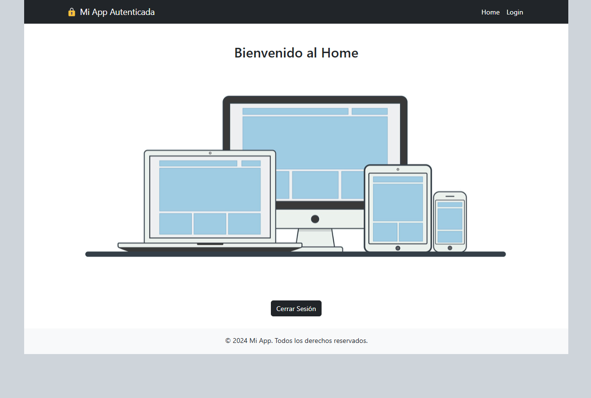

# **WEB APPLICATION WITH AUTHENTICATION** [](https://github.com/YADICEP)

This web application is managed through authentication and has three views: **Sign up**, **Login**, and **Home**, which is restricted to registered users.

## **Technologies Used**
- **Vue.js**
- **Vue Router**
- **Vite**
- **Firebase**
- **JavaScript**
- **Bootstrap**
- **HTML5**
- **CSS3**

## **Features**
1. **Authentication with Firebase Authentication**:  
   - Implements a user system using Firebase.

2. **Three main views**:  
   - **Sign Up**: Public, visible only to unauthenticated users, allows user registration.  
   - **Login**: Public, visible only to unauthenticated users, allows users to log in.  
   - **Home**: Private, restricted to authenticated users only.

3. **Access restrictions with Vue Router**:  
   - Uses Vue Router guards to restrict access to the **Home** view.

4. **Functional components**:  
   - A component to create new users.  
   - A component to log in.

5. **Production deployment**:  
   - Generate the production build and deploy it using Firebase Hosting.

## **Screenshots**
<p align="center">
  
</p>
<p align="center">
  
</p>

## **Installation**
1. Start the project:
   ```bash
   npm run dev
